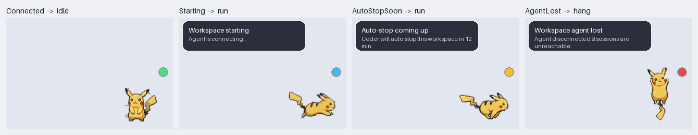

# Coder Mascot

A tiny desktop character that sits on your Windows desktop and tells you when your
Coder workspace has gone away — so you find out from a mascot waving at you, not
from a Claude session that silently stopped responding.

## Why this was built

This application was built out of a need to **improve day-to-day performance and
productivity while working at Mắt Bão**, where development happens inside remote
Coder workspaces rather than on the local machine.

Working that way costs time in small, repeated ways, and each of the features here
answers one of them:

- **A workspace that stops is not obvious.** The tooling reports it as running
  after the agent has already dropped, so the first sign is a Claude Code session
  that quietly stops answering — and the minutes spent working out whether it is
  thinking, stuck, or gone are pure loss. The mascot watches from *outside* the
  workspace and says so immediately.
- **"Has my work actually shipped yet?"** is a question git can answer only by
  being asked several times per branch, with the answers held in your head. That
  stops being possible at four repositories and thirty branches — which is an
  ordinary week here. The Branches window answers it in one screen, reading
  straight from the git server so no clone is needed.
- **Things left running cost money and confuse the next session** — a dev server
  from yesterday, a workspace idling overnight. They get noticed and offered up
  rather than discovered later.
- **Notes about a task belong next to the task.** Sticky notes live on the
  desktop, grouped per project, instead of in a scratch file nobody reopens.

It is a personal productivity tool, not a Mắt Bão product, and it holds no company
data: everything it shows it reads live from the Coder API and from git.

Built against Coder, so it works against any deployment — the workspace URL and
git server are configuration, not hard-coded.

## Why it lives on your desktop

The mascot **cannot** run inside the workspace. If it did, it would die at exactly
the moment it's supposed to warn you. It runs locally and watches the workspace
from outside — that's the whole point of the design.

## What it watches

Polls `GET /api/v2/users/{owner}/workspace/{name}` every 20 seconds and maps the
result to one of seven states:

| State | Animation | Badge | What it means |
|---|---|---|---|
| `Connected` | idle | green | Workspace running, agent connected and ready |
| `Starting` | run | blue, pulsing | Build or agent still coming up |
| `AutoStopSoon` | run | amber, pulsing | Coder will auto-stop the workspace within 15 min |
| `Unreachable` | hang | orange, shaking | Can't reach Coder at all — your network, VPN, or the deployment |
| `Unauthorized` | hang | purple | Session token missing or expired — run `coder login` |
| `AgentLost` | hang | red, shaking | Workspace "running" but the agent dropped. **Your sessions are dead.** |
| `WorkspaceDown` | hang | red, shaking | Workspace stopped, failed, or shutting down |



*Layout preview, not a screenshot — composed by `tools/preview_states.py` from
the same frames and coordinates the XAML uses. The app only runs on Windows.*

`AgentLost` is the one that motivated this. Coder still reports the workspace as
`running`, but the agent link is gone, so every Claude session inside it is
unreachable. Watching build status alone would miss it.

`AutoStopSoon` is the quiet win: it warns you *before* the auto-stop clock kills
long-running sessions, while you can still bump the deadline.

### Not crying wolf

Alarms require **two consecutive** bad polls before the mascot reacts
(`failuresBeforeAlarm`), so one dropped packet can't fake a disconnect. Recovery is
applied immediately — going back to green is never delayed.

## Install

You do **not** need a .NET SDK on the Windows machine — `EnableWindowsTargeting`
means the Windows binary cross-compiles from the Linux Coder workspace. Build in
the workspace, copy the output to Windows, run it.

```bash
# in the Coder workspace
export DOTNET_SYSTEM_GLOBALIZATION_INVARIANT=1     # this box has no libicu
                                                   # (the build host only — see below)

# small build — needs the .NET 8 Desktop Runtime on Windows (~760 KB)
dotnet publish -c Release -r win-x64 --self-contained false \
               -p:PublishSingleFile=false -o dist/needs-runtime

# or standalone — needs nothing installed (~139 MB single exe)
dotnet publish -c Release -r win-x64 -o dist/standalone
```

That environment variable belongs to the **build host** and must never become
`<InvariantGlobalization>true</InvariantGlobalization>` in the csproj. WPF cannot
run in globalization-invariant mode: its markup layer resolves a `CultureInfo`
from `XmlLanguage` to format text, and that throws `CultureNotFoundException` the
first time anything draws a character. The mascot is an image and a coloured dot,
so the app starts and patrols quite happily and then dies on the first
right-click. The build now refuses the property outright rather than shipping
that.

Copy the folder (or the single exe) to Windows and double-click it. The small
build needs the [.NET 8 Desktop Runtime](https://dotnet.microsoft.com/download/dotnet/8.0)
— note *Desktop*, not the plain runtime; WPF won't start without it.

Nothing is code-signed, so Windows SmartScreen will warn on first launch:
**More info → Run anyway**.

### First run

**Nothing to set up by hand.** The first time it starts with no credentials it
opens a window asking for two things:

1. **Your Coder address** — `coder.example.com` is enough; it fills in the
   `https://` for you.
2. **A session token** — press **Open the token page** and the app opens
   `https://<your-coder>/cli-auth` in your browser. Sign in, copy the token,
   paste it back. Press **Connect**.

It checks the pair against the API *before* writing anything, so a typo tells you
so instead of leaving you with a saved-but-wrong config and a mascot stuck on
Unauthorized. If you own more than one workspace it asks which to watch, rather
than picking one for you. Nothing else needs filling in.

Reopen it any time from **Connect to Coder…** in the tray menu, the mascot's
right-click menu, or the **Connect…** button on the dashboard — that is also the
fix when a session eventually expires.

Already a Coder CLI user? Run `coder login https://coder.example.com` and the
mascot reads that session on its own; the setup window never appears.

There's no main window: look for the tray icon. Right-click the mascot →
**Check now** to force a poll.

It adds itself to your logon apps the first time it runs — an app whose whole job
is to notice the workspace dying is no use on the day you forget to start it, and
that is exactly the day it was worth having. Untick **Start with Windows** in
either menu (or the same box in the dashboard's settings) to stop it; that writes
`"startWithWindows": false` and it is never re-added behind your back.

The entry is one HKCU `…\CurrentVersion\Run` value called `CoderMascot`, so
Windows lists it under Task Manager → Startup like anything else, and disabling
it there is honoured. It is re-pointed at the current exe on every launch:
moving the folder otherwise leaves a startup entry aimed at nothing, and the only
symptom is a mascot that quietly stops appearing.

## Configuration

Zero-config if you already use the Coder CLI: it **reads** the URL and session
token that `coder login` wrote to `%APPDATA%\coderv2\`.

It does not copy them. A borrowed token is stripped before anything is written
back, so `%APPDATA%\CoderMascot\config.json` holds only your settings and window
position — the CLI's session file stays the single copy on disk, and
`coder logout` still revokes local access.

```json
{
  "owner": "dev",
  "workspace": "dev",
  "pollSeconds": 20,
  "autoStopWarnMinutes": 15,
  "failuresBeforeAlarm": 2
}
```

Resolution order for `url` and `token`: config file → `CODER_URL` /
`CODER_SESSION_TOKEN` env vars → the Coder CLI's own session files.

A token that arrived from the CLI or the environment is **borrowed** and never
written to our file. A token you pasted into the setup window is **ours** — there
is no other copy of it, and refusing to store it would mean asking again on every
launch — so it is written to `config.json` in cleartext, the same as it would be
if you had typed it in there yourself. On a machine where that matters, use
`coder login` instead and let the CLI hold the only copy.

Leave `workspace` empty and it auto-detects, as long as you own exactly one.

`url` must be `https://` (loopback may use `http://`). The session token is
bearer-equivalent, so plaintext, embedded userinfo, and non-http schemes are
rejected outright, and redirects are never followed — .NET strips only
`Authorization` across origins, not a custom auth header.

## Interacting

- **Click** — "yes, I know" — see [Turning it down](#turning-it-down)
- **Drag** — move it; position is remembered
- **Right-click** — status, dismiss, message volume, new note, check now, open
  dashboard, edit config, quit
- **Double-click** — open the [dashboard](#the-dashboard)
- **Click-through** — mascot ignores the mouse when it's in the way (toggle back
  from the tray icon)
- **Tray icon** — a colored dot mirroring the state, always there even if you hide
  the mascot. Alarms also raise a Windows toast.

## The dashboard

Double-click the mascot or the tray icon. Everything the badge cannot say in one
colour, across four tabs — **Status**, **Notes**, **Ports**, **Settings**.

They used to be one long scroll: a scratchpad, then live status, then a port
list, then a settings form. Reaching the last of them meant scrolling past the
other three, every heading had left the top of the window by the time you got
there, and two of the panels had their own inner scrollbars fighting the outer
one. Each tab is now one scroll of related things, and **Status** — the reason
the app exists — opens first rather than sitting under the notes.

The counts live on the tabs. Something that wants attention is invisible while it
is behind a tab, which is exactly how a dev server left running for two days goes
unnoticed, so the number comes out to where you can see it without opening
anything; a red one means it is asking for something.

**Notes.** Your own scratchpad — see [Writing things down](#writing-things-down).

**Claude sessions.** One row per session: folder, what it is doing *right now*
(`Bash: dotnet test`, *Thinking…*, or Claude's own prompt text when it's waiting
on you), how long it has been in that state, and a **Go to it** button. That
button matches on window title, because that is the only thing every candidate
has in common — VS Code, Windows Terminal, JetBrains and a plain console all put
the folder or the command in their title. It says so plainly when nothing
matches, rather than appearing to do nothing.

**Workspace.** Build, agent, lifecycle, last used, auto-stop countdown — and
Start / Stop / Restart / `coder login`. Stop and Restart confirm first: they kill
every session inside the workspace, which is precisely the disaster the rest of
the app exists to warn about.

**This machine.** CPU and RAM drawn against your *warning line* rather than
against 100 — the question is "how close am I to the thing that nags me", and a
bar that never leaves the first third answers nothing. Below it, the biggest
memory families with a **Close all** button each.

**Local ports.** What is listening on this machine right now — see
[What's on my ports](#whats-on-my-ports).

**Left running.** The forgotten things — see below.

**Recent.** The last dozen state changes with times. Answers the question you
actually have when you come back to the desk: did the agent drop while I was
out, or did Claude just finish? Memory only, never written to disk — these lines
carry project paths and prompt text.

Plus a settings strip for message volume, the finish announcement, and the four
thresholds worth tuning. Values typed there go through the same clamps as values
read from the config file, so the dashboard can't reach a state the file can't.

## Writing things down

The sticky notes round the monitor, on the monitor: the port that dev server is
on, what you were doing before the meeting, the thing to pick up tomorrow.

### On the desktop

Press **Ctrl+Alt+N** anywhere — in the editor, in a browser, mid-build — and a
small note appears under the pointer with the caret already in it. Type. There is
no save button and no edit mode: the window *is* the note, and what you type is
written down.

- **Drag** it by its header, **resize** it from the corner. Where you leave it is
  where it comes back.
- The **coloured dot** cycles the paper; the right-click menu picks one directly.
  Six colours, and the same colour shows as a stripe on that note's row in the
  dashboard, so the desktop and the list agree about which note is which.
- **✓** ticks it off and puts it away. **✕** puts it back in the list without
  ticking it. Neither deletes anything — **Delete this note…** in the right-click
  menu is the only thing that does, and it confirms first.
- Notes stay on top but are **not in Alt+Tab** — a dozen of them would bury the
  windows you're actually switching between — and they hide with the mascot while
  something is full-screen. They also honour `hideFromScreenCapture`, which
  matters more here than it does for the mascot: a note is whatever you wrote on
  it, and you didn't write it for the meeting you're sharing your screen with.
- Whatever is on the desktop when you quit is back on the desktop next time. A
  note whose monitor has since been unplugged comes home rather than staying
  somewhere you can't reach, and one dragged above the top edge comes back down —
  its header is the only handle it has.

The shortcut is configurable, and it must have at least one modifier: a bare key
is registered *system-wide*, so binding `N` would stop every other application on
the machine receiving the letter N. If something else already owns the
combination, the mascot says so rather than doing nothing when you press it.

```json
{ "noteHotkey": "Ctrl+Alt+N" }
```

Blank turns it off; **New sticky note** in the tray and mascot menus still works.

### In the dashboard

**Notes** is the first panel, and it is where you browse, file and find notes
rather than write them. Type and press Enter (Shift+Enter for another
line). Every note is editable **in place** — click into it and type, no edit
mode and no dialog. Each one has:

- **Done** — a checkbox. Finished notes fade and sink to the bottom rather than
  disappearing, because "did I already do that?" is a question you ask later.
- **Pin** — keep it at the top regardless of age.
- **Delete**, and **Clear done** for the whole finished pile. Both confirm first.
- **Find** — filters as you type.
- **Stick** — put this one on the desktop. The button reads *On desktop* while it
  is up there, and pressing it again brings it back.

Clearing a note's text deletes it — but only once you've clicked away from it,
never mid-edit, or clearing one to retype it would delete it under your cursor.

### One list per purpose

One flat pile stops being a scratchpad at about twenty entries, so notes live in
named lists — work and home, or one per project. The tabs across the top of the
panel switch between them, each showing how much is still open in it, with
**All** in front for everything at once.

- **New list** names one and switches to it. **Rename** and **Delete list** act
  on the list you're looking at, so both are off under *All*.
- New notes land in the list on screen (the hint line under the box says which,
  and under *All* it's the first list). Refile a note with the small dropdown
  beside its timestamp — which only appears once there is a second list to move
  it to.
- **Clear done** clears the list you're in, not the others. Under *All* it says
  so before it does it.

A note is in exactly one list, deliberately: filing takes one decision and
tagging takes several, and this has to be faster than opening a text file or it
won't get used.

Deleting a list never deletes what's in it — its notes move to the first
remaining list, and the confirmation says how many and where they're going.
Renaming a list onto a name that already exists is refused rather than quietly
merging two piles. There is always at least one list, so the last one can't be
deleted.

### Where they live

`%APPDATA%\CoderMascot\notes.json`, not inside `config.json`:

```json
{
  "groups": ["General", "CONTRACT-APP"],
  "activeGroup": "CONTRACT-APP",
  "notes": [
    {
      "id": "8f14e45fceea167a5a36dedd4bea2543",
      "text": "vite is on 5173, dotnet watch on 5001",
      "group": "CONTRACT-APP",
      "colour": "yellow",
      "stuck": true,
      "bounds": [1180, 240, 240, 200],
      "pinned": true,
      "done": false,
      "created": "2026-08-24T09:12:04+07:00",
      "updated": "2026-08-24T09:31:22+07:00"
    }
  ]
}
```

`stuck` and `bounds` are what put a note back where you left it; an unknown
`colour` falls back to yellow and a malformed `bounds` is dropped rather than
half-used.

Lists are stored rather than derived from the notes, so a list you made stays
there while it's still empty. The file is meant to be hand-editable: a note
naming a list that isn't declared **creates** that list rather than being filed
somewhere else — the name you typed is the intent. A file still in the old shape
(a bare array, before lists existed) is read and upgraded, with everything landing
in `General`.

Its own file for two reasons. A hand-edited config that fails to parse falls back
to defaults, which for settings is fine and for notes would be data loss; and a
plain JSON array is something you can read, grep, back up or sync yourself.
**Open notes file…** in the panel opens it.

Writes go through a temporary file and a replace, and a file that can't be parsed
is moved aside as `notes-unreadable-*.json` rather than written over. Everything
else this app keeps on disk is a setting with a default behind it — a note is the
one thing it holds that you cannot get back.

Notes are saved after every action, when you click away from an edit, and when
the window or the app closes.

## Being told when it's done

The app only ever spoke up when something needed you or had gone wrong. But the
shape of working with an agent is that you start something and go and do
something else, and nothing was telling you it had finished.

Now a session going from working to idle says so once, with how long the turn
took: *"Claude in coder-mascot finished — 12 min."*

The timing comes from the hook, not from the desktop: `runSince` is stamped only
on a transition *into* running, so the several hook events inside one turn don't
keep restarting the clock, and a terminal that has been open for two hours still
reports a twenty-minute turn. Detection is edge-triggered against the previous
poll — a session that stays idle for an hour is announced once, not every 30
seconds — and the very first reading after launch announces nothing, or startup
would greet you with a burst of notifications about work that finished before
the app was running.

The badge stays green throughout. Finishing is an event, not a condition; there
is no such thing as *being* in the finished state, and modelling it as one would
leave the mascot sitting on "done" until something else happened.

```json
{ "announceFinished": true }
```

## What's on my ports

The question you ask several times a day — *what is on 5173, and why is 3000
busy* — answered without a terminal. The **Local ports** panel lists every TCP
port in a listening state on this machine:

```
:3000   node  ·  pid 18244        localhost only · up 12 min      [Open] [Close]
:5001   dotnet  ·  pid 9008       all interfaces · up 5 min       [Open] [Close]
:5432   postgres  ·  pid 3120     all interfaces · up 3d          [Open] [Close]
```

- **Green** ports are yours — a runtime a developer starts by hand, by the same
  classification the [leftover watch](#things-left-running) uses. Grey is the
  machine's own.
- **Open** launches `http://localhost:<port>` in your browser. **Close** asks the
  owning process to shut down — `CloseMainWindow`, never `Kill`, the same rule as
  everything else here.
- **Find** takes a port number or part of a process name. A number searches
  *ports*, not pids: "what is on 5173" is the question, and matching that against
  a process id answers one nobody asked.
- Ports below 1024 are hidden behind the **System ports** tick. On Windows that
  range is almost entirely the OS, and it buries the four ports you started.

Both address families are swept. On Windows `localhost` resolves to `::1` first
and plenty of dev servers bind IPv6 only — an IPv4-only sweep would report
nothing on the very port your browser is talking to, which is worse than having
no list at all.

One process usually appears in the OS table three or four times: IPv4, IPv6, an
extra bind. Those are merged per port and process, and the reachability shown is
the *widest* of the binds, because that is who can actually reach it. Two
different processes on the same port stay two rows — hiding one is how you spend
an afternoon on a port you were sure you had freed.

The sweep runs off the UI thread and is cached for a few seconds: it walks every
listening socket and opens a handle per owning process, which is not something to
do on the thread drawing the window, and the set of listening ports changes far
more slowly than the dashboard repaints.

## Where work has got to

`Branches…` in the tray or mascot menu. The question it exists for is the one a
branch list cannot answer: **is the thing I wrote three weeks ago in what the
server is running?** Git knows, but only if you ask it several questions per
branch and hold the answers in your head — which stops being possible at four
repositories and thirty branches.

### Adding one

**+ Add** in the projects rail, or **Edit…** in the header for one already
listed. No JSON, and nothing to look up.

A repository can be read from three places, and the first is usually the one
you want:

| | | |
|---|---|---|
| **From a git URL** | `https://git.example.com/team/contract-ui.git` | fetched once into a copy of its own, then read locally |
| **In the workspace** | `/home/coder/workspace/projects/CONTRACT-APP` | over `coder ssh` — accurate, but a round trip per command |
| **On this PC** | `C:\src\api.example.net` | a clone you already have checked out |

The form knows the two things you would otherwise have to get right blind:

- **Where it is.** For a URL, paste the address you would clone. Otherwise
  *Find…* lists the repositories in your workspace (`~/workspace/projects`,
  `~/workspace/share-projects`) and *Browse…* opens a folder picker for a clone
  on this PC. Either way it then runs `git` against what you chose and says what
  it found — `Found a repository — 34 branches · on main · 2 uncommitted` —
  before anything is saved.
- **The branch names.** Once the folder checks out, the deploy-branch box is a
  list of the branches that are actually there. A branch name typed from memory
  is the expensive mistake here: it doesn't fail, it reads as *not merged*, for
  something that shipped a fortnight ago.

It will not, however, refuse to save when the check failed. A stopped workspace
or a laptop off the VPN is a bad reason to be unable to write down a repository
you already know you have — the panel says what could not be confirmed, and a
deploy branch that isn't in the repository *right now* is kept, and marked.

The first deploy branch in the list is the one `↑ahead ↓behind` is measured
against; **Count against this** on any other row moves it up. Removing a
repository removes it from this list and touches nothing on disk.

**Group** files it under a heading in the rail. The box lists the groups you
already use, so joining one is a pick rather than a retype that might not match;
typing a new word makes a new heading. Leave it blank and it sits below the
groups, on its own.

A group is a plain word on the repository, not an object defined somewhere else,
and that is the whole design rather than a shortcut. It means there is no such
thing here as a group that exists with nothing in it, or a repository pointing at
a heading that has been deleted — renaming a group is retyping the word, and
removing one is clearing it off the last repository that used it. `Backend` and
`backend` are one heading, spelled the way whoever got there first spelled it.
The cost is that headings can't be dragged into an order of your choosing: they
appear in the order their first repository does.

### Reading straight from a URL

The quick one, and the one that needs nothing set up. Press **Download** in the
editor (or **Fetch from origin** in the window) and the app fetches its own bare
copy under `%LOCALAPPDATA%\CoderMascot\mirrors`. Every read after that is a
local `git` process against a few megabytes — no ssh round trips, no working
tree, nothing to clone yourself.

It is small because it is **history only**: the fetch asks for commits and trees
and no file contents at all, which is every byte the questions this window asks
actually need. The test repository above is 164 KB; a real one is usually single-
digit megabytes against hundreds for a full clone. The editor shows the size and
when it was last fetched.

The copy is set up as an ordinary remote rather than `clone --mirror`, so the
server's branches land under `refs/remotes/origin/*` exactly as in a normal
clone. That matters beyond tidiness: a `--mirror` puts them in `refs/heads/*`,
where they look local, and every one of them would be labelled **safe to
delete** — an offer to tidy up somebody else's server.

**Signing in.** A private server is reached with whatever credentials Git
Credential Manager already holds — if you clone the repo on this PC already, it
just works. If it doesn't, the editor has **Username** and **Password or access
token** boxes; on GitLab that's your username and a personal access token with
read access.

What you type there is handed to *Git's* credential store — Windows Credential
Manager, via `git credential approve`, down a pipe so it never appears on a
command line — and never to `config.json`, which is plain settings and no place
for a secret. Every other git tool on the machine can then use it too. A
password pasted into the URL is stripped for the same reason.

Git's store is checked before anything is sent: `git credential approve` with no
helper configured exits 0 and stores *nothing*, so trusting it would have the
window report "signed in" and then fail the next fetch identically. If there is
no store, it says so and gives you the one command that creates one.

Terminal prompts are disabled for these commands, so a server that wants
credentials the app hasn't got fails in seconds with a message that names the
two boxes — rather than hanging on a pipe nobody can type into.

### When it doesn't work

**Download**, **Check again** and **Test connection** are three buttons because
they are three different actions: fetch from the server, read the copy already on
this PC, and ask the server whether it can be reached at all. Download used to be
the same button as Check again, relabelled by whichever one the app judged you
needed — so on the one occasion the judgement was wrong, the action you wanted was
not on the screen anywhere. Download is safe to press repeatedly; it updates the
copy you have rather than starting over.

**Test connection** asks the server directly, with `git ls-remote`. It downloads
nothing, creates nothing and changes nothing, so it can be pressed as often as
you like while sorting out a token. It exists because "it won't download" has
four different causes that arrive looking identical, and it tells them apart:

| | |
|---|---|
| `Reached the server and signed in — 34 branches there.` | the URL, network, sign-in and access are all fine |
| `Couldn't reach git.example.com at all.` | wrong host, no route, or a VPN you aren't on |
| `Reached … but the sign-in was refused.` | no credentials, or the wrong ones |
| `Signed in … but this account can't see that repository.` | wrong path, or a token without read scope |
| `… git doesn't trust its certificate on this PC.` | a proxy, or a private CA |

**Show what git said** unfolds the last dozen git commands and their real error
text — every friendly sentence above is a translation, and a translation loses
the detail that identifies the fault. It opens by itself when something fails.
**Save to a file** writes it to `%APPDATA%\CoderMascot\git-log.txt` so it can be
sent rather than retyped. Passwords never travel in an argument (the sign-in goes
down a pipe), and any credential that somehow reached one is stripped on the way
into the log.

**A fetch that didn't fetch is never reported as an empty repository.** Neither
of git's own traces can be trusted for this: `init --bare` creates the object
store before any fetch, and a fetch that dies asking for a password still writes
`FETCH_HEAD`. So the app writes its own marker, only on a fetch that returned
success — and removes it again when a fetch proves the copy unusable, because a
claim that outlives the attempt behind it is the same lie in slower motion. Without it, a refused sign-in shows up as `Found a repository — 0
branches` in green, which is the exact "couldn't find out" rendered as an answer
that the rest of this window goes to such lengths to avoid.

**A branch Windows can't store doesn't lose you the other thirty.** Git keeps one
file per branch, so a branch name is also a path — and Windows refuses a path
segment containing `" * : < > ? |`, which a branch named out of a ticket title
very often has:

```
error: cannot lock ref 'refs/remotes/origin/Dashboard-"Lượt-ký"---Tổng-quan-/-Nhân-viên':
       unable to create directory for ./refs/remotes/origin/Dashboard-"Lượt-ký"---…
```

Git calls the whole fetch a failure. When everything it objected to is that
shape, the app **asks again with those branches left out** — git takes negative
refspecs, so `^refs/heads/Dashboard-"Lượt-ký"…` skips the one that can never be
written and fetches the rest properly. The download then succeeds, and the only
thing missing is the branch that was never storable, named in a footnote.

Asking again beats keeping whatever the failed attempt left behind, which is not
reliably anything: a fetch that dies mid-transaction can roll every ref back, and
a copy holding some unknown fraction of a repository is not something to report
as a download. If the retry can't help either — an older git without negative
refspecs, or something else wrong as well — the copy is **un**-marked, so it goes
back to offering Download instead of reporting an empty repository as a finding.

The real fix is renaming the branch on the server, which also fixes `git clone`
on Windows for everyone else on the team.

The test for it is narrow on purpose. `Permission denied` and `File exists`
arrive through the identical `cannot lock ref` sentence and mean something you
have to be told — a read-only folder, a lock left behind by a git that was
killed — so those stay failures, and a fetch that hits both is a failure too.

Only `https://`, `ssh://` and `git@host:path` are accepted, plus `http://` on
loopback. `git://` and plain `http://` are refused for carrying sign-in in the
clear, and `ext::…` is refused because git reads it as *a command to run*.

### The file it writes

```json
"projects": [
  {
    "name": "contract-ui",
    "path": "https://git.example.com/team/contract-ui.git",
    "where": "remote",
    "group": "CONTRACT-APP",
    "deployed": { "main": "production" }
  },
  {
    "name": "CONTRACT-APP",
    "path": "/home/coder/workspace/projects/CONTRACT-APP",
    "where": "workspace",
    "group": "CONTRACT-APP",
    "deployed": { "main": "production", "Golive-Redesign": "staging" },
    "primary": "main"
  },
  {
    "name": "api.example.net",
    "path": "C:/src/api.example.net",
    "where": "local",
    "deployed": { "master": "production" }
  }
],
"collapsedGroups": ["contract"]
```

Still hand-editable, and the editor writes through the same sieve the loader
uses, so what it saves is what a restart reads back.

`where` is `remote` (a URL, read from a copy the app fetches for itself),
`workspace` (over `coder ssh`, the same channel the session watch uses) or
`local` (a clone on this PC); for `remote`, `path` is the URL. `deployed` maps a branch to what it means
when something reaches it — **named, not guessed**. A rule like "anything called
release*" is right until a repo calls its live branch `Golive-AcmeSign`, and
then it is silently wrong about the only question this feature exists to answer.
Leave `name` out and the folder's name is used. `primary` names the deploy branch
the ahead/behind counts run against; leave it out and it's the first one listed.
`group` is the heading in the rail, and `collapsedGroups` is which of those
headings are folded shut — lower-cased, since case doesn't make a second group,
and pruned on load to the headings that still exist.

### What it shows

Three regions, and they no longer share one scroll. **Deployed** is pinned at
the top because it is the reference everything below is measured against;
**Branches** and **What landed, and when** sit side by side, each scrolling on
its own, with a splitter between them. Stacked, the timeline was forty rows
below the branch it explained — which is the one place you actually want the two
together: *has this shipped* and *when did it ship*.

The rail on the left lists the repositories, under group headings once anything
has a group. A group heading's triangle sits in the gutter at the pane's own left
edge, and the heading's title and the repositories filed under it share one column
inset from it — they used to be 4px apart, which is exactly close enough to read
as a mistake rather than as a step. Clicking a heading folds it away and the fold is remembered between
runs — a fold that forgets itself every launch is one nobody uses twice. The
outstanding count stays on the heading whether it is open or shut, because
folding a group away must not fold away the reason to look inside it, and if the
repository you are on is inside a folded group the selection mark comes up to the
heading so *where am I* still has an answer on screen. A rail with no groups in
it looks exactly as it did before groups existed.

**Deployed** — one card per deploy branch: the environment, the branch, and what
landed on it last.

**Branches** — grouped under headings, in the order the question is asked:
deploy branches, then what hasn't shipped anywhere, then what is half in, then
what couldn't be checked, and only after all of that the things that are
finished. A flat list sorted by date puts something that shipped in March
directly above something that has never shipped at all, and reading it is
arithmetic. The groups partition the list exactly — there's a test for it, since
a branch in two groups appears twice and a branch in none vanishes silently.

Above the list, pinned so it can't scroll away, is the count of each group **as a
button that filters to it**: reading "12 not shipped" and then hunting for the
control that shows you those twelve is two steps where there's no reason for
two. Sort by recency, name, how far behind, or author. `Ctrl+F` jumps to the
filter box; `Esc` widens back out one step at a time — text filter, then trace,
then group — and only then does nothing; `F5` re-reads.

Each row carries
the last commit, its author, how long ago, `↑ahead ↓behind`
against the primary deploy branch — named in the tooltip, so the number has a
visible reference point — and one pill per environment: `✓ staging · 2d`
or `— production · not yet`. The pills say it in words, not just colour, because
a wall of green and grey dots is a puzzle rather than an answer. A left stripe
gives the quick read: blue is a deploy branch, green landed everywhere, amber
landed somewhere, grey nowhere yet. A local branch that is merged everywhere and
has no remote left is tagged **safe to delete** — the tidy-up everyone forgets.

**What landed, and when** — the merge timeline for one deploy branch: a spine
with a dot per landing, day headings down the left, newest first. **Trace** on any
branch narrows it to that branch's own landings, which is the "when did this
actually ship" question.

### What it does and doesn't know

Merge state is **ancestry**, from `git branch --merged` — the truth, not a name
match. Landing *times* come from the merge commits on the deploy branch's own
first-parent history, so a merge that reached some other branch is never reported
as a deploy here.

When a check **fails** — a dropped `coder ssh`, a timeout — that column reads
**unknown**, in words and in its own colour, and the window says so in a banner.
It never renders "couldn't find out" as "not merged": that looks exactly like an
answer, and a wrong answer here is worse than no window at all. A failed **fetch**
is a banner too, not an error page — the branches on disk are still true, and the
machine with no credentials for the remote is exactly where that list is all you
have.

A **squash merge** breaks the ancestry link by design: the commits genuinely
aren't there any more. Such a branch reads as not merged even though its name may
appear in the timeline. That is a limit of squashing, and the window says so
rather than trusting the name — which would report a deleted-and-recreated branch
as landed when it isn't.

Deploy comparisons use the remote-tracking ref **as it was actually seen**, so a
clone whose remote is called `upstream` — or that has two — works; nothing is
rebuilt as `origin/…`.

Reading **never touches the network**, so opening the window is free and works
offline; branch state is read from your local refs and `refs/remotes/origin/*`.
Deploy comparisons prefer the *remote* ref, since that is what CI shipped from —
a local `main` three weeks stale would otherwise report live work as unmerged.
**Fetch from origin** is the one button that goes to the server, on your say-so.

git itself is resolved to an absolute path — the usual install locations, then
an explicit `PATH` walk, never the app's own folder, which is where a portable
copy sits and where Windows would otherwise look first. Set `"gitPath"` in the
config for an install the search doesn't find.

Six git commands per repository, however many branches it has: `%(ahead-behind:)`
counts every branch in a single pass on git 2.41+, and older gits get the same
list without the numbers rather than a per-branch storm over SSH.

## Things left running

One state, `Leftovers`, for two things that feel identical from the outside:

**An idle workspace.** Measured from Coder's own `last_used_at` — the same field
its auto-stop is driven by — rather than from anything the mascot infers.
Guessing from Claude sessions alone would call the workspace idle while you were
happily working in code-server, and there is no faster way to make a warning
worthless than to be wrong while someone is looking at it.

**Dev servers nobody is talking to.** The [CPU/RAM watch](#watching-this-machine)
structurally cannot see these: a Vite server or a `dotnet watch` you finished
with two hours ago sits at 0% CPU and a few hundred megabytes, never coming near
the thresholds, while still holding a port, a file watcher and a chunk of the
working set.

```json
{ "watchLeftovers": true, "workspaceIdleMinutes": 45, "devServerIdleMinutes": 120 }
```

Classification is by owning process, not by port number, and that is deliberate.
Port ranges get both answers wrong: plenty of real services live on 8080, and a
dev server on 4173 looks like nothing at all. The runtime that owns the socket is
the honest signal — nothing but a developer starts `node`, `uvicorn` or `dotnet`
listening on a desktop. Ports below 1024 are never reported; half of what listens
on a Windows box is Windows.

The age gate is the whole feature. You are *supposed* to have a dev server
running while you work, and a warning that fires the moment you type
`npm run dev` is a warning about doing your job.

This never parks the mascot in a corner and never starts a reminder cycle — it
is one toast, a teal badge, and rows in the dashboard with the buttons that
resolve them. High load is costing you speed *now*; a leftover is costing you
tidiness, and can wait until you look. Anything actually wrong outranks both.

Closing is always `CloseMainWindow` — the same signal as clicking the X, so
VS Code still prompts about unsaved files. **Never `Kill`.** A tidy-up feature
that can silently destroy an hour of work is not a tidy-up feature, it is a bug
with a button.

## Turning it down

Everything above is only useful if you can make it stop, and the two reasons to
want it to stop are different, so they are two separate controls.

**"I know about this one."** Click the mascot. The toast, the speech bubble and
the repeat nudges stop, and it goes back to patrolling instead of standing in the
corner waving. A click on the character is the one gesture that needs no menu, no
aiming and no reading — and it is exactly the thing that is bothering you, so it
is where your mouse already is. Same item in the right-click menu and the tray
menu, for when the mascot is click-through or hidden.

What it does **not** do is make the problem look solved. The badge stays whatever
colour the truth is and the tray tooltip still says what's wrong; a dismissed
alarm is a quiet alarm, never a cleared one. Dismissing covers this problem only:
when the state changes, the next thing gets its own full chance to interrupt —
including the same problem coming back after a good spell, which is the common
case when Claude answers one prompt and hits another twenty seconds later.

**"Stop talking to me in general."** *Messages* in either menu:

| | Toast | Bubble | Nudges | Comes to get you | Badge |
|---|---|---|---|---|---|
| **Show everything** (default) | ✅ | ✅ | ✅ | ✅ | ✅ |
| **Quiet** | — | — | — | ✅ | ✅ |
| **Off** | — | — | — | — | ✅ |

```json
{ "notifications": "all" }
```

Quiet keeps the mascot walking to a corner and hanging there, on purpose: with
the words gone, movement is the only signal left, so silencing the text must not
silence that too or "quiet" quietly becomes "off". An unreadable value falls back
to `all` — failing quiet would disable the alarms of an app whose only job is to
raise them.

## Watching your Claude sessions

Two things the Coder API cannot tell you, because they happen *inside* the
workspace:

| State | Means |
|---|---|
| `NeedsConfirmation` | A Claude session is sitting at a permission prompt waiting for you |
| `SessionStalled` | A session says it's running but hasn't done anything in a long time |

"Needs confirmation" is not inferred — it comes from Claude Code's own
`Notification` hook, and the bubble shows Claude's actual prompt text
("Claude needs your permission to run git push"), not a generic count.

### Setup

Run this **inside the workspace**, once:

```bash
bash ~/workspace/projects/coder-mascot/workspace/install-hooks.sh
```

It copies two small scripts to `~/.claude/mascot/` and registers eight hooks in
`~/.claude/settings.json`. It backs the file up first, **merges** rather than
replaces (hooks you already have are kept), never duplicates on re-run, and
`--uninstall` removes it cleanly. Restart any running Claude sessions afterwards.

Until you do this the feature is **inert** — and that used to look exactly like
good news. The mascot now says so, in its right-click menu, rather than staying
quietly green.

The desktop side needs the `coder` CLI on `PATH` and reads the status over
`coder ssh` every 30 seconds — no server has to stay running in the workspace.

```json
{
  "watchSessions": true,
  "sessionPollSeconds": 30,
  "sessionStalledSeconds": 600,
  "sessionThinkingStalledSeconds": 180
}
```

### What "stalled" really means

Two numbers, because there are two kinds of silence and they mean opposite
things.

**With a tool running**, silence is normal — a long build, a big test run or a
slow `npm install` genuinely produces no hook events for minutes, and that is
indistinguishable from a wedged session. `sessionStalledSeconds` is generous
(10 min) for that reason; raise it if your builds are longer.

**While Claude is thinking**, nothing is running except the model call, so the
same silence means that call is slow or dead. `sessionThinkingStalledSeconds` is
3 minutes. It is clamped to never exceed the tool threshold — configured the
other way round it would silently never fire, because a thinking session would
hit the tool number first and be reported as the patient kind.

One number for both was a large part of why a real hang went unreported: safe
for a 15-minute build means far too patient for a dead request. The other part
was that a session which hung *before its first tool call* never left `idle` at
all — no tool ran, so no tool hook fired. `UserPromptSubmit` is hooked now, so
the turn is marked the moment it starts.

It is still a heuristic and it will occasionally be wrong.

Workspace problems outrank session problems: if the agent has dropped, "Claude
needs you" is both untrue and unactionable, so the disconnect wins.

## Watching this machine

Separately from the workspace, the mascot watches the PC it is running on.

| State | Means |
|---|---|
| `ResourcesHigh` | This machine has been pinned at high CPU or memory for a while |
| `Leftovers` | An idle workspace, or dev servers still listening — see [Things left running](#things-left-running) |

```json
{
  "watchResources": true,
  "cpuWarnPercent": 88,
  "memoryWarnPercent": 88,
  "loadSustainSeconds": 120
}
```

**`loadSustainSeconds` is the number that matters.** A build pegs every core for
a minute, and a warning that fires on that is one you stop reading within a day —
at which point it may as well not exist. Nothing is reported until the load has
*stayed* up for two minutes. Clearing is stickier still: the reading has to fall
several points below the line, or a machine parked exactly at the threshold
toggles the warning on and off every poll.

The message names what to close:

> Memory is at 91% — Code ×7 (9.4 GB), chrome ×4 (2.1 GB).

That is the actual point. "Memory is at 91%" is something you could have seen
yourself; the list is the part you forgot. Processes are grouped by name because
one editor window is a renderer, a language server and three extension hosts —
listing those separately buries the fact that seven windows are open.

The process list is only walked when a warning is about to fire. Enumerating
every process on the machine every ten seconds to say nothing would make the
monitor the thing worth complaining about.

Readings come from `GetSystemTimes` and `GlobalMemoryStatusEx` — two kernel
calls, no setup. Deliberately not `PerformanceCounter`, which needs the
perf-counter service, takes a second or more to prime, and returns 0 or throws
often enough on a stripped Windows install to be a liability.

## Being reminded

One notification at the moment something happens is the wrong shape for
forgetting. The prompt arrives while you're in a full-screen editor or looking at
the other monitor, and the toast is long gone by the time you look back.

So anything needing attention — a waiting Claude prompt, a dropped agent, a
straining machine — gets brought up again, with the gap doubling each time and
then holding:

```json
{ "remindAfterSeconds": 120, "remindMaxSeconds": 900 }
```

First nudge after 2 minutes, then 4, then 8, then every 15. Front-loaded while a
reminder can still help, settling into a slow pulse once nobody is clearly at the
desk. Both halves matter: a fixed interval fast enough to catch you in the first
minute is unbearable by the tenth, and an uncapped backoff puts the tenth
reminder hours out, which is the same as not reminding at all.

Each nudge says how long it has been — "waiting 12 min" reads as time being
wasted, where "still waiting" reads as the same notification again. Set
`remindAfterSeconds` to 0 for the old single-notification behaviour, or click the
mascot to stop the nudges for the thing currently on screen.

Nothing fires while a full-screen app is up. The shell is already suppressing
notifications there, and a mascot that overrides that during a screen share is
worse than a missed prompt.

## How it behaves

The mascot walks the perimeter of your desktop — along the bottom, up the sides,
across the top — pausing to idle at random. It never wanders into the middle of
the screen.

**Motion is the health signal.** While everything is fine it patrols. When
something needs you, it runs to the nearest top corner, hangs there and shakes
until it's resolved. A mascot that has stopped moving is a mascot with something
to say.

| Edge | Moving | Paused |
|---|---|---|
| bottom | `run` | `idle` |
| left / right | `climb` | `climbidle`, clinging on |
| top | `hang`, swinging along | `hang` |

Every edge has artwork drawn for it, so **nothing is rotated**. An earlier
version turned the floor frames ±90° onto the walls, which reads as a character
lying on its side rather than one climbing; the wall art is drawn upright, back
to the wall, the way it actually looks.

Facing follows the *wall*, not the journey: the wall frames are drawn with the
wall on the character's left, and the right-hand wall simply mirrors them. Tying
it to travel direction instead — which is right for the floor and the ceiling —
would turn the mascot to face into the bricks every time it changed its mind
mid-climb. [Core/Pose.cs](Core/Pose.cs) holds that rule, in Core rather than the
UI for one reason: a wrong answer there throws nothing and logs nothing, so it
needs a test.

Position on the loop is a single scalar: distance travelled clockwise from the
top-left corner. That collapses "which edge, at what offset, facing which way"
into one number, so movement is `s += speed * dt` and corners need no special
handling. The geometry lives in [Core/Perimeter.cs](Core/Perimeter.cs), kept free
of WPF types precisely so it can be tested where the app can't even run —
see `tests/PerimeterTests`.

Controls: **hover** over it and it stops, so you can actually click a 96px target
that crosses its own width in about a second. **Drag** it anywhere and it snaps
back to the nearest edge and carries on. Right-click → **Walk around the edges**
to turn patrolling off.

```json
{
  "mascotSize": 64,
  "patrol": true,
  "patrolSpeed": 90,
  "patrolBounds": "virtual",
  "hideFromScreenCapture": true,
  "hideWhenFullScreen": true
}
```

`mascotSize` is the window size in DIPs (32–320); the character fills about 80%
of it. Everything else — sprite, badge, mirror pivot, and the patrol geometry,
which measures the window — scales from it.

### Multi-monitor

`patrolBounds: "virtual"` walks every monitor; `"primary"` stays on the main one.

The patrol rectangle is the bounding box of all monitors, which only matches the
monitors themselves when they're identical and aligned. On a normal mismatched
setup **19–28% of that perimeter has no display behind it** — a mascot walking
into it vanishes for ~25 seconds, which reads as a crash. Worse, the alert corner
derived from that box could land somewhere invisible, so the disconnect alarm
would fail silently.

So the perimeter is built from each monitor's **work area** (which also puts the
mascot *on* the taskbar rather than over it), positions with no display behind
them are stepped over, and the alert corner is chosen from a real monitor. All of
that is covered in `tests/PerimeterTests` against five real arrangements,
including landscape+portrait and a second monitor to the left.

Known gap: on **mixed-DPI** setups the sprite is bitmap-scaled on non-primary
monitors and looks soft. Positioning is correct. Fixing it properly needs a
PerMonitorV2 manifest *and* moving the patrol geometry to physical pixels —
doing only the first would trade blur for a positioning bug, so it's deliberately
left alone.

### Staying out of the way

`hideFromScreenCapture` keeps the mascot out of screenshots and screen shares
(on by default — a mascot walking across a shared presentation is a worse
surprise than not being able to record it; turn it off to demo it).
`hideWhenFullScreen` parks it while a game, video or presentation is running,
using the same shell signal Windows uses to suppress notifications.

## The character

Three characters, and you can run any combination:

```json
{ "characters": ["pikachu", "charizard", "mew"] }
```

Both at once is two windows, two patrols and two speech bubbles — but still
**one** workspace poll and **one** session poll between them. A second mascot is
a second thing to draw, not a second `coder ssh` every thirty seconds. Each
remembers where it was last dropped separately, and the tray menu shows and
hides them independently.

| | frames | moves by |
|---|---|---|
| **Pikachu** | 44 — `idle` 13, `run` 8, `hang` 6, `climb` 11, `climbidle` 6 | walking |
| **Charizard** | 48 — `idle` 13, `fly` 8, `flyidle` 8, `hover` 7, `ascend` 4, `descend` 8 | flying |
| **Mew** | 55 — `idle` 15, `fly` 7, `flyidle` 8, `hover` 8, `ascend` 7, `descend` 10 | flying |

All at 96px, compiled into the assembly as WPF resources so a single-file
publish stays single-file and the app can never run with its artwork missing.

The two move differently because their artwork gives them no choice: a dragon
has no climb and nothing to hang from. Charizard flies the same perimeter —
`fly` along the top and bottom, `ascend` or `descend` up a wall depending on
which way it's heading, `hover` when it stops, and it lands to `idle` on the
floor. The rules live in [Core/Pose.cs](Core/Pose.cs), keyed by movement style.

Their body heights land within a few pixels of each other (60, 63 and 53 in a
96px frame), so they read as a matched set; Charizard is simply wider, for the
wingspan.

`hang` covers every alarm state: the character is literally clinging on, which is
what a dropped agent feels like. It is also the top-edge animation, and the alarm
perch is a top corner, so the two agree.

### Why the frames need stabilising

The generator drew each frame as a separate picture, not as a cycle, so the
character's size and position wander from frame to frame. Played back that reads
as jitter rather than motion. `stabilise()` fixes it in three passes:

1. **Normalise scale by ink area**, not bounding box — a bounding box includes
   the tail, which flails, so bbox-based sizing actively injects jitter.
2. **Align by cross-correlation** against the mean silhouette, twice.
3. **Reorder into the smoothest loop** (greedy + 2-opt on 1−IoU). Applied to
   `run`, whose frames were never a real sequence, and to `climb`, which is two
   takes concatenated and needs them interleaved rather than played one after the
   other. `idle` keeps its order — it contains a genuine blink that shuffling
   would destroy.

It also **drops a frame that matches nothing else in its row**. Scored against
its best neighbour rather than its average one — a frame at one end of a real
cycle looks nothing like the other end, and that isn't a defect — every genuine
frame on this sheet lands within 0.90–1.04 of its row's median, and the one bad
frame lands at 0.60. That frame has a translucent grey artifact welded to the
character's tail: too grey to keep, too attached to separate. The script prints
what it dropped.

Frame-to-frame IoU after stabilising, where 1.0 is a still image and a hitch
shows up as a low worst-case:

| | mean | worst | ink area spread |
|---|---|---|---|
| idle | 0.88 | 0.70 | 1.11× → 1.00× |
| run | 0.77 | 0.60 | 1.11× → 1.00× |
| hang | 0.81 | 0.76 | 1.12× → 1.00× |
| climb | 0.87 | 0.77 | 1.14× → 1.00× |
| climbidle | 0.83 | 0.78 | 1.18× → 1.00× |

The sheet draws the climb cycle **twice** ("Climb Wall Left" and "Climb Wall
Right"). Once each frame is turned to face its wall they're the same animation,
so they play as one — but that's checked rather than assumed. On an earlier sheet
the two takes disagreed about the body's angle, a single loop had to cross
between them, and the worst transition fell to 0.53: a visible hitch every 1.2
seconds. Only one row was used. On this sheet they agree, and merged they beat
either take alone on both measures with nearly twice the cycle length. If a
future sheet regresses, the numbers the script prints will say so.

All five animations then share **one scale**, normalised on body ink area, so the
character doesn't change size when it starts running, and **one square canvas**
sized to contain every frame whole. Nothing is ever clipped to keep the body
large — an earlier version sized the canvas from the 88th percentile of frame
extents and cut the ears off most of the run cycle. On-screen size is controlled
by `mascotSize` instead.

### Regenerating the frames

The frames are derived from `Asset/` by `tools/extract_sprites.py`:

```bash
python3 -m venv .venv && .venv/bin/pip install pillow numpy
.venv/bin/python tools/extract_sprites.py --qa    # frames + app.ico + QA sheet
.venv/bin/python tools/preview_states.py          # the preview image above
```

The source in `Asset/` is not a usable sprite sheet — it's an AI-generated
*illustration of* one, and the extractor is mostly a list of workarounds for
that:

- **"Transparency" is a drawn checkerboard.** Every pixel of the file is opaque.
  Background is found by colour and connectivity, not by alpha. The squares blend
  where they meet, and a blend sits far from *either* tone, so the seams survive
  as a grid of hairlines and weld themselves onto whatever they touch — the
  extractor samples the line between the two tones to catch them. The tones
  themselves are **measured from each band's own border**, not hardcoded: two
  sheets in, the generator has already shifted them by 15, which is enough to
  leave a hardcoded value sitting on the edge of its tolerance, quietly letting
  seam pixels through.
- **The props are drawn in the character's own yellow.** The hanging row has a
  bar and the climbing rows have wall poles; no colour test can separate them.
  They come out on the grounds that a prop is straight and spans the whole band
  and a Pikachu is neither. Where a paw grips, the prop is kept.
- **A prop seals a pocket of background** between itself and the belly pressed
  against it. A flood starting at the band border can never reach in there, so
  that patch counts as ink and the character ships with a square of grey tiling
  glued to its back.
- **There are no frame captions and neighbouring poses overlap.** Frames are
  found by clustering ink columns, then assigned whole blobs rather than cropped
  at the boundaries — one character's tail reaches 25px into the next one's
  column range, and cropping there amputates it on every lap. Only genuinely
  fused art gets a straight edge through it.
- **The wall rows disagree about which side the pole is on**, so half the frames
  face the wrong way. Facing is normalised at extraction, not in the app.

`--qa` writes `Assets/qa-contact-sheet.png` with every frame over both a light
and a dark backdrop — check it after any change, since halos are invisible
against the backdrop they match.

The band coordinates are measured from one specific layout. Regenerate the sheet
at another size and they go quietly wrong — wrong bands still find *some* ink and
would yield a pile of plausible-looking garbage frames. So the script refuses to
run unless the sheet has the expected dimensions, every band's border yields two
checkerboard tones (they're sampled from there, and a border that isn't
background also leaves the flood nothing to start from — the whole row then comes
out as one giant "character"), each row that should have a prop has one, and
every band splits into its expected frame count.

### Adding a character

Frames live in `Assets/sprites/<character>/<animation>/01.png…`. The loader
reads upward and stops at the first gap, so frame counts are free.

A character needs the full animation set for its movement style, listed in
`Pose.All` — a walker needs `idle run hang climb climbidle`, a flier needs
`idle fly flyidle hover ascend descend`. Add it to `Character.All`, and the
geometry tests will check its folders exist rather than trusting them.

Each sheet gets its own extractor script, because no two of them have shared a
layout yet. What they *have* shared is their problems, and that part lives in
[tools/spritekit.py](tools/spritekit.py): the checkerboard removal, the frame
splitting, the stabiliser, the outlier drop. A new sheet supplies coordinates
and little else — [tools/extract_charizard.py](tools/extract_charizard.py) is
about 200 lines, most of it comments about the sheet's own quirks.

> The bundled artwork depicts Nintendo / Game Freak characters. Fine for a
> personal desktop toy — the same footing every Shimeji skin has always stood on
> — but don't ship or redistribute it.

## Weight

The tray icon is composited at runtime and there are no loose asset files.
Animation is a `DispatcherTimer` swapping a frozen `BitmapImage` at 8–14fps on a
320×215 transparent window, and the window *moves* rather than drawing across the
screen. Frames pause entirely while the mascot is hidden, which matters because
`AllowsTransparency` forces software rendering. Idle cost is one HTTP GET every
20 seconds.

## Colour and spacing

Every colour the windows use lives in [`UI/Theme.xaml`](UI/Theme.xaml) (for markup)
and [`UI/Tone.cs`](UI/Tone.cs) (for code), and the two hold the same palette. Every
control *style* lives in [`UI/Controls.xaml`](UI/Controls.xaml).

They exist because the alternative had grown to **fifty-two hexes**, and the count
was the diagnosis. Three windows each declared their own `Ink`, `Card`, `Line`
and `Deep`, so the palette drifted one edit at a time into two different families
of dark blue — one true slate, one bluer and more saturated — mixed together in
the same panes. That is what makes an interface look unfinished when the layout is
already right: not one bad colour, but a set of colours that were clearly never
chosen together.

Two rules hold it together now:

- **Every surface is the same hue, one step apart**, so depth reads as depth
  rather than as a colour change: `Well` (what you type into) → `Rail` (sidebars)
  → `Page` → `Head` (the bars) → `Row` → `Card` → `Lift` (hover).
- **Every meaning gets one hue at one weight.** All seven marks are the
  400-weight of their hue, which is what makes a row of them look like a set. The
  old mix of 400s and 500s meant some states shouted and others washed out with no
  relation to how urgent they actually were.

Three bugs fell out of writing it down, which is the argument for having done it:

| | |
|---|---|
| *"partly shipped"* and *"couldn't check"* were **the same amber** in the chip strip — two different answers, rendered identically | `Unsure` is orange now, and different from `Partly` at a glance |
| a deploy branch and the row you had clicked were **both `#3B82F6`** | `Pick` means selection and focus, and nothing else; a deploy branch is indigo |
| the mascot's ring and the dashboard's pip read the same state from **two hand-maintained tables** | one `Tone.For(state)`, so they cannot drift again |

Spacing and type are on scales too — 4/6/8/10/12/16 for space, `11 / 12 / 13 / 15`
for type, and nothing else. The type scale matters more than it sounds: the old
sizes included `10.5`, `11.5` and `12.5`, and with `TextFormattingMode="Display"`
a half-pixel face rounds unpredictably from one line to the next, which is a real
and quite mysterious source of text looking uneven.

The styles were the same story as the colours, one level up. Each of the four
chrome windows declared its own `Muted`, `SectionHead`, `Primary`, `CardBorder`
and implicit control styles — and four copies drift:

| | |
|---|---|
| `SectionHead` had **three different margins** in three windows | one style, no margin; `SectionTop` adds it for stacked forms |
| the **primary** button was `14×7` at 13px in one window and `10×5` at 12px in another | one `Primary` |
| `TextBox` had **four different paddings** and two font sizes | one style, plus `Inline` for the one that sits in a list row |
| `Slight` and `Quiet` were **byte-identical under two names** | `Quiet` |

`Controls.xaml` is merged per-window rather than into `App.xaml`, deliberately:
its implicit styles would otherwise repaint the sticky note — yellow paper with a
text area on it — and the speech bubble, which are desktop objects with their own
look rather than app chrome.

Spacing resources are `Thickness`, not a scale of `Double`s, because XAML cannot
compose a `Thickness` out of `Double`s — a `Space2` would be a number nothing
could actually be spaced by. Only values repeated enough to be worth one
definition are named; `Margin="0,0,6,0"` alone appeared 22 times.

## Tests

The app is WPF and only runs on Windows, so the parts worth testing were
deliberately kept free of WPF types and live in `Core/`. All three suites run on
a Linux workspace with no Windows machine anywhere:

```bash
dotnet run --project tests/PerimeterTests -c Release   # geometry + poses
dotnet run --project tests/ConfigTests    -c Release   # credentials + config
bash tests/workspace/run.sh                            # the Claude Code hooks
```

Each exists because something got through:

- **ConfigTests** — a security review caught the app copying the Coder CLI's
  live session token into its own config the first time you dragged the mascot,
  a credential that then survived `coder logout` and permanently shadowed the
  next `coder login`.
- **PerimeterTests** — a multi-monitor bug left the mascot walking through dead
  space for ~25s a lap, and sent the disconnect alarm to a corner with no
  display behind it. The pose checks were added later for a failure that is
  quieter still: a mascot facing into a wall throws nothing and logs nothing.
- The load and reminder checks in **ConfigTests** are there because neither can
  fail loudly either. A warning that fires on every build, or flaps on and off
  at the threshold, or nags at a fixed interval forever, is not a bug you can
  see in a stack trace — it is one you discover by living with it for a day.
  So the tests assert the judgement: a 90-second build stays quiet, two minutes
  of it does not, a machine hovering exactly at the line never flaps, and the
  reminder gaps grow and then stop growing.
- **tests/workspace** — the stall detection missed real hangs. One check
  asserts the old single threshold missed a case the split thresholds catch, so
  that specific regression can't come back.
- The **AlertGate** checks guard the one way a mute button can be worse than no
  mute button: silencing a live alarm in a way that also makes it look solved,
  or that carries over and swallows the next real problem. So they assert what
  survives a dismissal — the badge stays red, the state still needs attention,
  and the next state gets its full voice back.
- The **finish** and **leftover** checks are about the two ways each can be
  useless. A finish notification that never fires leaves you waiting on work
  that is already done; one that isn't edge-triggered repeats every 30 seconds
  for an hour. A leftover warning that fires on `svchost` or on the dev server
  you started a minute ago is one you turn off within a day. Both directions are
  pinned down, including a `last_used_at` stamped in the future — a skewed clock
  would otherwise read as "idle forever" and offer to stop a workspace somebody
  is sitting in.

## Building on Linux / CI

`EnableWindowsTargeting` is set, so `dotnet build` works on a Linux Coder
workspace even though the binary only runs on Windows. Single-file and
self-contained packaging are conditioned on a RID being passed, so a plain
`dotnet build` doesn't try to resolve a nonexistent linux-x64 WPF runtime pack.

The Coder workspace has no `libicu`, so the SDK aborts on startup there. Export
`DOTNET_SYSTEM_GLOBALIZATION_INVARIANT=1` before building — the app itself
already sets `InvariantGlobalization`, this is only the CLI.

## Not in this version

This is the disconnect-warning MVP. Deliberately out of scope for now:

- **Claude session events** (session waiting for input, session finished, errors).
  The pipe already exists — `~/.claude/settings.json` feeds every hook into
  a separate Claude-Code-Agent-Monitor service, which exposes SSE at
  `/api/events` on port 4820. Reaching it from the desktop needs
  `coder port-forward dev --tcp 4820:4820`; the tunnel dropping is itself a
  faster disconnect signal than polling.
- Shimeji-style walking, physics, and sprite-pack support.
- Watching more than one workspace at a time.

## Licence

[MIT](LICENSE). The sprite sheets under `Asset/` are frames of Pokémon
characters, used here as placeholder artwork for a personal tool — they are not
covered by that licence and are not mine to relicense. Swap in your own artwork
before doing anything with this beyond running it yourself; see
**Adding a character** above, which is a spritesheet and one config entry.
